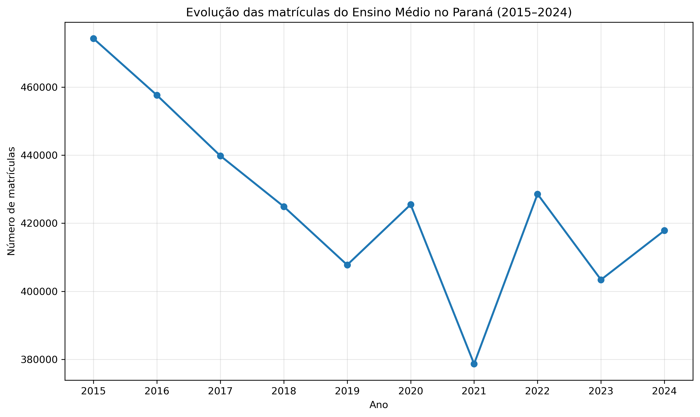
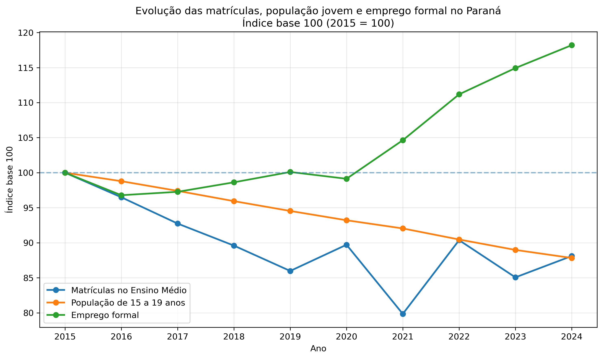

# Análise das Matrículas do Ensino Médio no Paraná

## Sobre o projeto

Este projeto apresenta uma análise exploratória da evolução das matrículas do Ensino Médio nos municípios do Paraná entre 2015 e 2024.

O estudo faz parte da transformação do Trabalho de Conclusão de Curso (TCC) do MBA em Data Science & Analytics (USP/ESALQ) em um portfólio de Ciência de Dados.

---

## Objetivo

Compreender a dinâmica das matrículas do Ensino Médio no Paraná e identificar tendências relacionadas à população jovem e ao emprego formal.

---

## Dados

A base utilizada reúne informações municipais para os 399 municípios do Paraná.

Para esta etapa foram utilizadas as seguintes variáveis:

- Matrículas do Ensino Médio
- População de 15 a 19 anos
- Emprego formal
- Taxa de reprovação

O período analisado foi de 2015 a 2024.

A análise foi realizada a partir de uma base construída com dados públicos provenientes do INEP, IBGE e RAIS, integrados em nível municipal para os 399 municípios do Paraná.

Os arquivos de dados não estão disponíveis neste repositório.

---

## Tecnologias utilizadas

- Python
- Pandas
- Matplotlib
- Excel
- QGIS (etapas futuras)

---

## Análises realizadas

### Evolução das matrículas no Paraná

Foi construída uma série temporal agregada para avaliar a evolução das matrículas do Ensino Médio no estado entre 2015 e 2024.

---

### Comparação utilizando Índice Base 100

Para comparar variáveis com escalas diferentes, foi utilizado o índice base 100 (2015 = 100).

Foram comparadas:

- Matrículas do Ensino Médio
- População de 15 a 19 anos
- Emprego formal

---

### Variação municipal das matrículas

Também foi calculada a variação percentual das matrículas entre 2015 e 2024 para os municípios do Paraná, gerando uma base para análises espaciais e construção de mapas.

---

## Autor

Davi Catelan

MBA em Data Science & Analytics – USP/ESALQ
